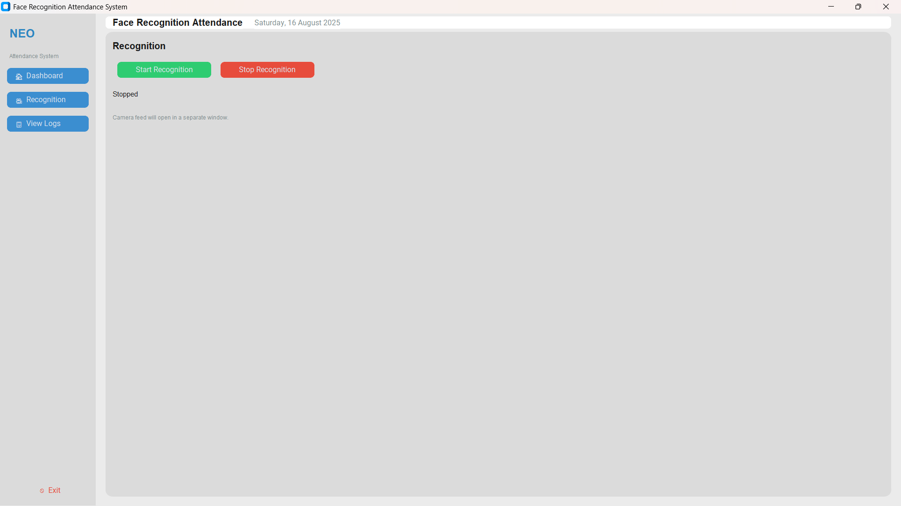
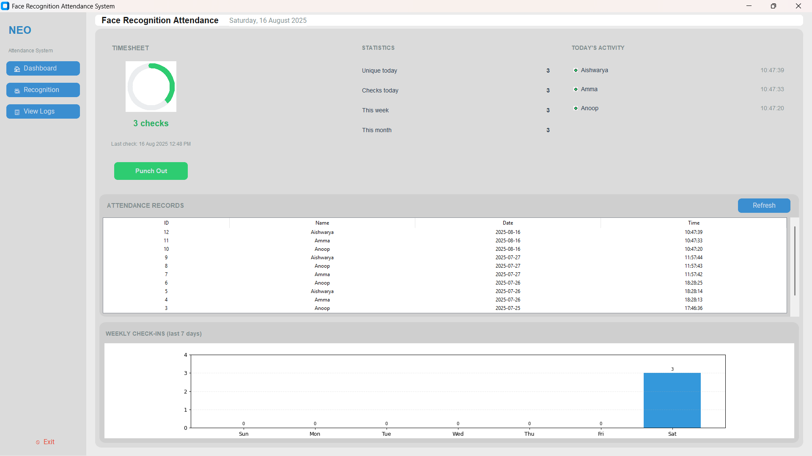

# Face Recognition Attendance System 🎯

A **Face Recognition Attendance System** with a **modern dashboard UI** built using **Tkinter (CustomTkinter)** and **MySQL**.
This system detects faces, marks attendance automatically, and displays real-time statistics and attendance logs on a clean dashboard interface.

---

## ✨ Features

* 📸 **Face Recognition** – Detects and recognizes faces for attendance marking.
* 🗂 **Database Integration (MySQL)** – Stores `Name`, `Date`, and `Time` of attendance.
* 📊 **Dashboard UI** – Clean, modern interface with statistics, timesheet, and attendance log.
* 🔍 **Attendance Log Table** – Displays recorded attendance with scrollable view.
* 📅 **Auto Date & Time Capture** – Automatically stores current date and time.
* 🖥 **Responsive Layout** – Well-structured dashboard with sections for Stats, Timesheet, and Logs.

---

## 🏗 Tech Stack

* **Python 3.7+**
* **Tkinter / CustomTkinter** (for modern GUI)
* **OpenCV** (for face recognition)
* **MySQL** (for data storage)

---

## 📂 Project Structure

```
├── dashboard.py        # Main dashboard with UI
├── face_recognition.py # Face recognition logic
├── db_connection.py    # MySQL database connection
├── requirements.txt    # Python dependencies
└── README.md           # Project documentation
```

---

## ⚙️ Installation & Setup

1. **Clone the Repository**

   ```bash
   git clone https://github.com/your-username/face-recognition-attendance.git
   cd face-recognition-attendance
   ```

2. **Install Dependencies**

   ```bash
   pip install -r requirements.txt
   ```

3. **Setup Database (MySQL)**

   ```sql
   CREATE DATABASE attendance_db;
   USE attendance_db;

   CREATE TABLE attendance (
       id INT AUTO_INCREMENT PRIMARY KEY,
       name VARCHAR(255),
       date DATE,
       time TIME
   );
   ```

   Update your MySQL username & password inside `db_connection.py`.

4. **Run the Application**

   ```bash
   python dashboard.py
   ```

---

## 🚀 How It Works

1. System detects and recognizes faces through the webcam.
2. Attendance is stored in **MySQL** with `name`, `date`, and `time`.
3. Dashboard shows:

   * **Statistics** → Total attendance count
   * **Timesheet** → Daily logs
   * **Attendance Log Table** → All entries

---

## 📸 Screenshots

## Main Page


## Dashboard


---

## 🔮 Future Improvements

* Add **filters** by date/name in attendance logs
* Export attendance by date range (CSV/Excel)
* Improve recognition accuracy with advanced ML models

---

## 🤝 Contributing

Pull requests are welcome. For major changes, please open an issue first to discuss what you would like to change.

---

## 📜 License

This project is licensed under the MIT License.
